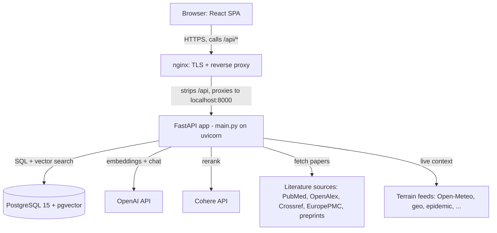
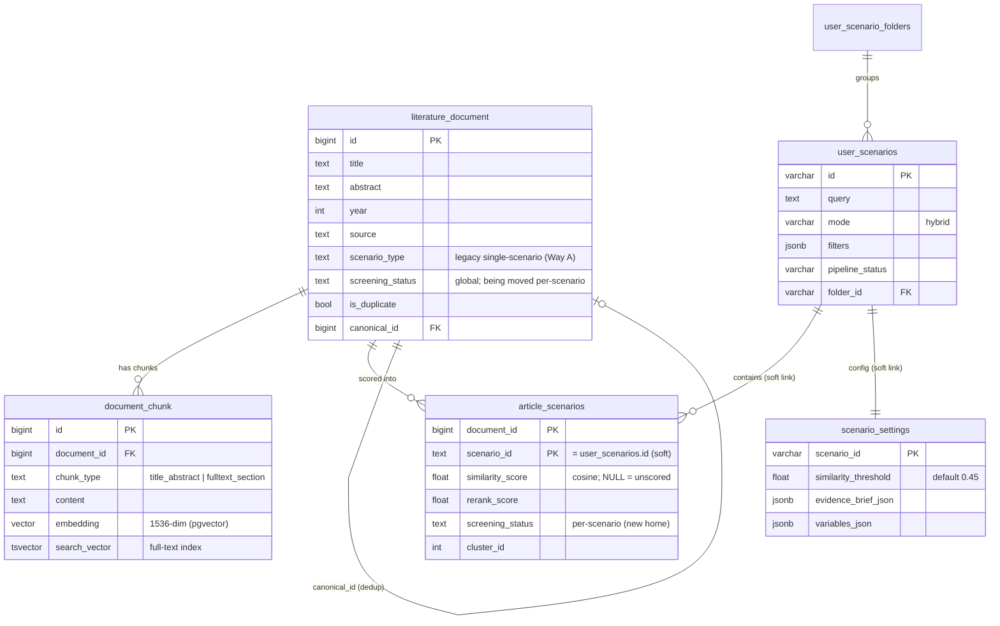
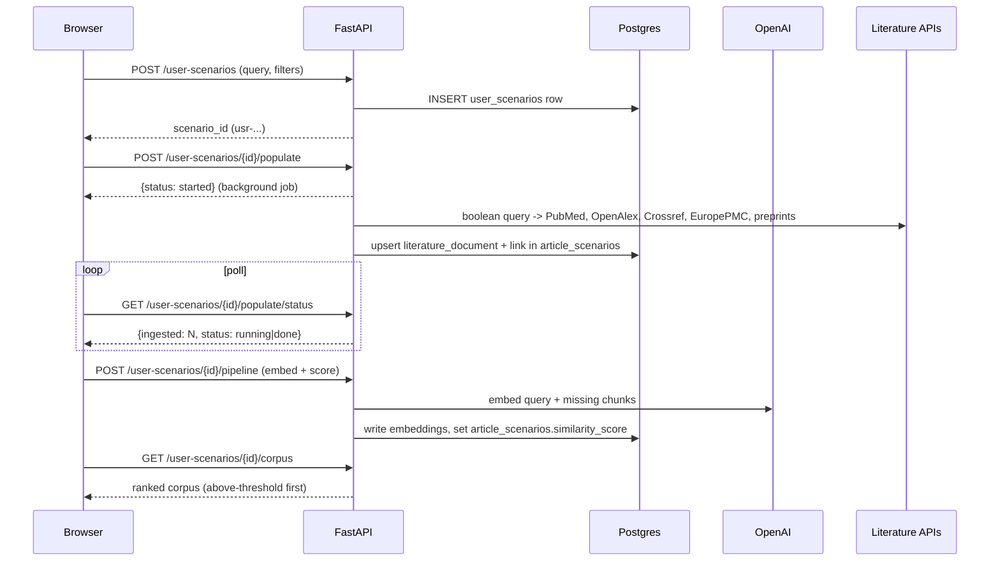
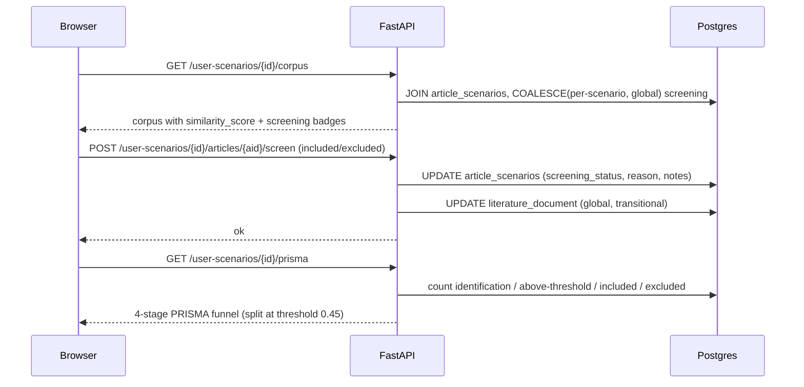
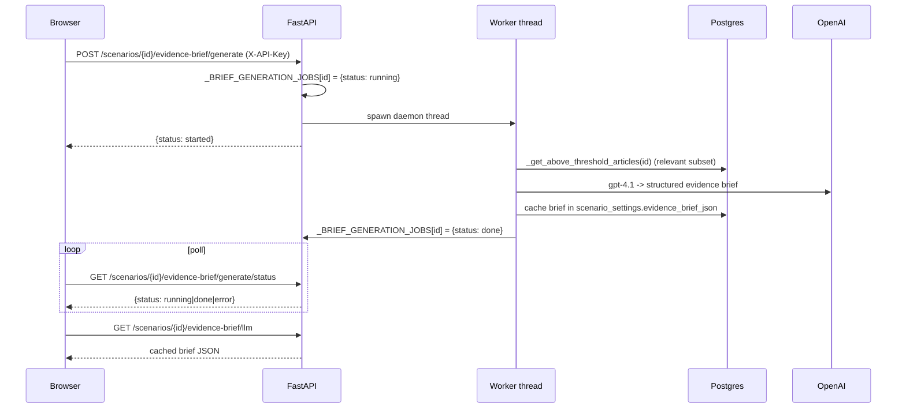
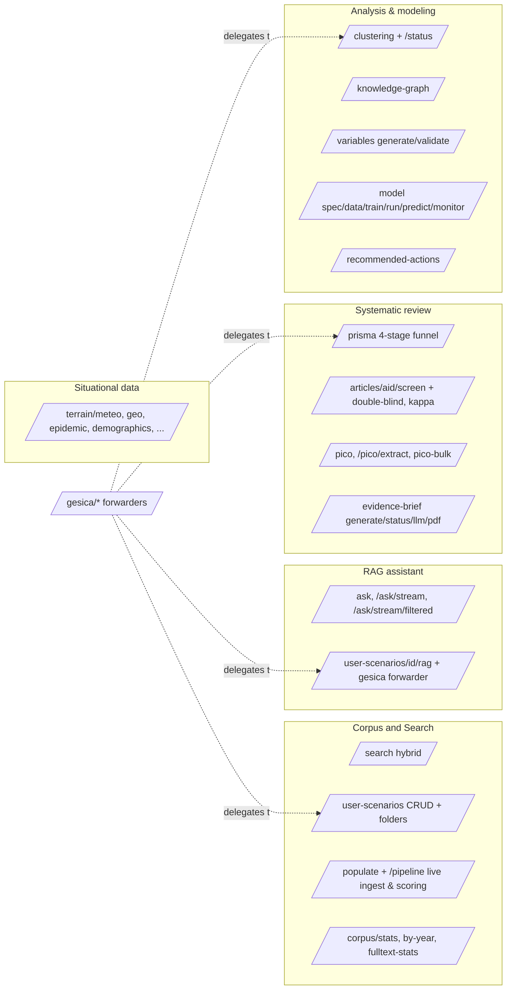
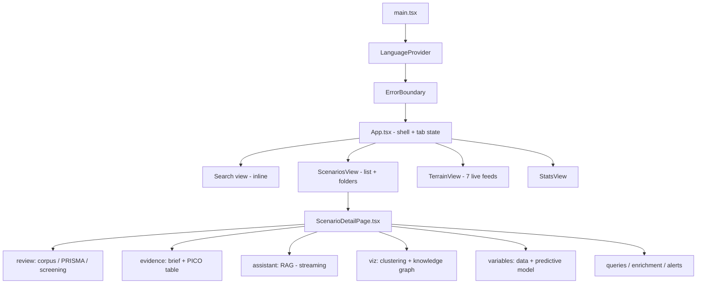

# LiteRev-Evidence — Architecture

A step-by-step, plain-language tour of the whole system: what it does, how the
pieces fit together, how data flows, and how it ships. Written for the project
owner. Diagrams are [Mermaid](https://mermaid.js.org/) — GitHub and most editors
render them inline.

> **Jargon, up front (each is re-explained in context):**
> - **Embedding** — a list of 1536 numbers that captures the *meaning* of a piece
>   of text, so two texts about the same thing land near each other.
> - **Chunk** — a document split into searchable pieces (here: its
>   title+abstract, plus each full-text section).
> - **pgvector** — a Postgres extension that stores embeddings and finds the
>   nearest ones fast.
> - **RAG** (Retrieval-Augmented Generation) — answer a question by first
>   *retrieving* the most relevant chunks, then asking an LLM to answer *using
>   only those chunks*.
> - **Rerank** — a second, more precise model that re-orders an already-shortlisted
>   set of results (here: Cohere).
> - **PRISMA** — the standard reporting flow for a systematic literature review
>   (how many papers were found → screened → included).
> - **PICO** — a way to summarize a clinical study: Population, Intervention,
>   Comparison, Outcome.

---

## 1. What the app does

LiteRev-Evidence turns a research question into a living, evidence-backed
**scenario**. You describe a scenario (a query + filters); the system pulls
matching papers from the live literature (PubMed, OpenAlex, Crossref, EuropePMC,
preprints) plus its own database, scores each paper for relevance, and lets you
run a full systematic-review workflow on top of that corpus: screen papers in/out
(PRISMA), extract PICO summaries, ask an AI assistant grounded in the corpus
(RAG), generate an evidence brief, cluster the literature, build a knowledge
graph, and even derive candidate variables for a predictive model. GESICA (an
emergency-medical-services use case) rides on the exact same engine — its
`/gesica/*` endpoints just forward to the generic scenario code.

---

## 2. High-level architecture

Four layers: the **browser** (React SPA), **nginx** (TLS + reverse proxy that adds
the public `/api` prefix), the **FastAPI** backend (one big `main.py` on uvicorn),
and the **data + external services** it depends on.

- **Browser** — a single-page React app (Vite build) served as static files. It
  talks only to `/api` (relative), so it works on any host/TLS setup.
- **nginx** — terminates HTTPS for `literev-scenario.com`, serves the static
  frontend, and reverse-proxies `/api/*` to the backend, removing the `/api`
  prefix. (So `localhost:8000` has **no** `/api` — that prefix is nginx-only.
  This matters when you `curl` the backend directly on the server.)
- **FastAPI (`main.py`)** — the entire backend: ~13k lines, ~126 routes, no ORM,
  no task queue. Runs under uvicorn as the `literev-api` systemd service on
  `localhost:8000`.
- **PostgreSQL + pgvector** — the single source of truth (papers, chunks,
  embeddings, scenarios, screening, settings). Lives on a *separate* host.
- **OpenAI** — embeddings (`text-embedding-3-small`) and chat (`gpt-4.1` /
  `gpt-4.1-mini` / `gpt-4o-mini`).
- **Cohere** — reranking (`rerank-v3.5`), optional (no-op without the key).
- **Literature sources** — public APIs queried live when building a corpus.
- **Terrain feeds** — live situational data (weather, geo, epidemic signals…)
  for the "Terrain" dashboard.

---

## 3. The data model

Everything lives in Postgres. The five tables that matter:

- **`literature_document`** — one row per paper (title, abstract, year, source,
  DOI, quality score, dedup fields). `scenario_type` is a *legacy* single-scenario
  tag stamped at ingestion (see §8). `screening_status` here is the *global*
  include/exclude decision, currently being migrated to per-scenario.
- **`document_chunk`** — the searchable pieces of each paper. **Chunk model:**
  exactly **one `title_abstract` chunk per document** (chunk_index 0, inserted
  idempotently) plus **N `fulltext_section` chunks** (one per section, re-created
  on each full-text fetch). Each chunk carries an `embedding` (`vector(1536)`, the
  pgvector column — 1536 is the dimension of OpenAI's `text-embedding-3-small`)
  and a `search_vector` (Postgres full-text index, auto-maintained by a trigger).
  This dual storage is what powers **hybrid search** (keyword + semantic).
- **`article_scenarios`** — the heart of the model: the **many-to-many** join that
  says "this document belongs to this scenario, with this relevance score." One
  document can be scored into many scenarios. Composite primary key
  `(document_id, scenario_id)`. It carries the *scored membership*
  (`similarity_score`, `rerank_score`), the **per-scenario screening decision**
  (`screening_status`/`reason`/`notes`/`screened_at`), and clustering
  (`cluster_id`, `cluster_label`). The link to `user_scenarios` is by convention
  (`scenario_id = user_scenarios.id`), not a hard DB foreign key.
- **`user_scenarios`** — one row per scenario: its `query`, search `mode`,
  `filters` (JSONB), and pipeline bookkeeping (`populate_status`,
  `pipeline_status`, `article_count`…). GESICA's built-in scenarios live here too
  (`is_system = TRUE`), which is why the GESICA and user paths can share one
  implementation.
- **`user_scenario_folders`** — optional folders to group scenarios (1:N).
- **`scenario_settings`** — per-scenario config and cached artifacts: the
  `similarity_threshold` (default **0.45**) and cached JSON for the evidence
  brief, variables, clustering, knowledge graph, and recommended actions.

> **Schema note (real, worth knowing):** the DDL is split across `schema.sql`
> (only `literature_document`, `document_chunk`, `alembic_version`), the
> `_ensure_*()` boot functions in `main.py` (which create `user_scenarios`,
> `user_scenario_folders`, `scenario_settings` and add columns), and Alembic. The
> **`article_scenarios` table has no `CREATE TABLE` anywhere in the repo** — it
> was hand-applied on the production DB and is only ever `ALTER`ed/queried in code
> (documented in `AUDIT_REPORT.md`). So a fresh DB built purely from the repo
> would be missing it. Treat the *live* DB as the source of truth.

---

## 4. Request / data flow

Three concrete journeys.

### 4a. A search (which really creates a scenario)

Counter-intuitively, the "Search" tab does **not** call a one-shot `/search`
endpoint. In the UI, running a search **creates a scenario and populates its
corpus** — so every search becomes a reusable, screenable corpus. (The raw
`POST /search` endpoint still exists — hybrid keyword+vector over the whole
corpus — and is used internally / by the deploy smoke test.)

### 4b. Building a scenario corpus + screening

Once a corpus exists, you screen papers in/out. The write is **per-scenario**:
it records the decision on the `(scenario_id, document_id)` row in
`article_scenarios` (via `_write_ars_screening`) and, for now, also keeps the
global `literature_document.screening_status` in sync (a transitional dual-write,
see §8). PRISMA counts and the "relevant" subset then reflect that decision.

### 4c. Generating an evidence brief (async job + poll)

Expensive LLM work never blocks the request. A `POST` starts a background thread
and returns immediately; the UI polls a `status` endpoint until `done`, then
fetches the cached result. This is the standard pattern for briefs, variables,
model training, clustering, recommended actions, and reranking.

---

## 5. Backend map (`main.py`)

One file, no ORM (SQLAlchemy Core with `text()` and `with engine.connect()`
inline), no Celery. The engine is a pooled `create_engine(DB_URL, pool_size=10,
max_overflow=20, pool_pre_ping=True, ...)`. Think of the routes as functional
modules:

**Startup (`@app.on_event("startup")`, line 562).** Runs `SELECT 1`, then in a
background thread builds performance indexes — including the pgvector **HNSW**
approximate-nearest-neighbor index on `document_chunk.embedding` (so semantic
search stays fast). It also **recovers orphaned jobs**: any scenario left
`running`/`starting` from a previous process (threads die on restart) is reset or
auto-relaunched, and a permanent enrichment worker embeds chunks / extracts PICO /
backfills abstracts on a loop. Schema is created/extended by idempotent
`_ensure_*()` DDL functions run at import time (e.g. `_ensure_user_scenarios_table`,
`_ensure_scenario_settings_table`, `_ensure_double_blind_columns`).

**The GESICA forwarders.** Every `/gesica/scenarios/{id}/*` endpoint is a thin
delegator: e.g. `POST /gesica/.../rag` is literally
`return user_scenario_rag_assistant(...)`, and `/gesica/.../prisma` →
`get_user_scenario_prisma(...)`. GESICA scenarios are just `user_scenarios` rows
with `is_system = TRUE`, so there is **one** pipeline behind both URL families.
(A few `/gesica/*` routes with genuinely GESICA-specific logic — dedup status,
dataset upload — are not forwarders.)

**The background-job pattern.** Expensive work runs in daemon threads tracked by
in-memory dicts keyed by `scenario_id`: `_RERANK_JOBS`, `_BRIEF_GENERATION_JOBS`,
`_VARIABLES_GENERATION_JOBS`, `_SPEC_PROPOSAL_JOBS`, `_ACTIONS_JOBS`,
`_MODEL_TRAIN_JOBS` (plus a locked `_user_scenario_pipeline_jobs`). A `POST`
checks for an active job (returns `already_running` if so), sets
`JOBS[id] = {status: "running"}`, spawns `threading.Thread(target=_run,
daemon=True)`, and returns `{status: "started"}`. `_run` overwrites the entry with
`{status: "done"}` or `{status: "error"}` (the `try/except` is essential — a
crashed thread must not leave a job stuck at `running` forever). A matching
`GET .../status` just returns the dict. Because state is in memory, jobs are lost
on restart — which is exactly why startup re-launches orphans.

**Key cross-cutting helpers:**
- **`_build_where(filters)`** (1372) — turns a filters dict into a parameterized
  SQL `WHERE` fragment for `literature_document`. Normalizes legacy
  `project_context` values to `literev`, and (post-migration) rewrites a
  `scenario_type` filter into an `EXISTS (… article_scenarios …)` membership check
  instead of a plain column match. Shared by `/search` and `/ask`.
- **`_get_above_threshold_articles(scenario_id, threshold)`** (10467) — the
  canonical "relevant subset" query. Joins `article_scenarios`, drops excluded
  papers, and keeps rows that are `included` **or** whose
  `COALESCE(similarity_score, 0) >= threshold`. Feeds the briefs and the model.
- **`_llm_lang_directive(lang)`** (359) — appends "respond entirely in
  FR/EN" to LLM prompts. **French is the default.**
- **Per-scenario screening via COALESCE** — reads everywhere use
  `COALESCE(ars.screening_status, d.screening_status)`: the per-scenario value
  wins, falling back to the global column when NULL. Writes go through
  `_write_ars_screening()` (dual-write to both, transitional). This is the read
  side of Migration 2 (§8).
- **`require_api_key`** (192) — the write-auth dependency. Reads the `X-API-Key`
  header, constant-time-compares it to `WRITE_API_KEY`, and is attached to every
  mutating endpoint via `Depends(...)`. Reads are open; writes require the key.

**Other cross-cutting facts:** in-memory per-IP **rate limiting** (600/min
general, 30/min on expensive paths like `/search`, `/ask*`, RAG, full-pipeline);
Pydantic models are used sparingly (~10: `SearchIn`, `AskIn`, `DocumentIn`,
`UserScenarioIn`, …) since most endpoints take path/query params.

---

## 6. Frontend map

A lean React 19 + Vite + TypeScript + Tailwind SPA. Deliberately minimal: **no
router**, **no charting library** (charts are hand-built SVG/Tailwind), and a
**hand-rolled i18n** (no i18n dependency). Almost the entire UI lives in two large
files.

- **Shell (`App.tsx`).** Holds the four main views via a plain
  `activeTab` state (`"search" | "scenarios" | "stats" | "terrain"`) and a
  header tab bar — no URL routing. The **"Clé admin"** button in the header
  captures the write key with a `prompt()` and stores it in
  local/sessionStorage (never in the bundle); without it the UI is read-only.
- **`ScenarioDetailPage.tsx`.** The scenario workspace: eight sections
  (`review`, `evidence`, `assistant`, `viz`, `variables`, `queries`,
  `enrichment`, `alerts`) chosen by an `activeSection` state, each wrapped in its
  own `ErrorBoundary` so one crashing panel can't take down the page. Several
  sections have nested sub-tabs (e.g. review → corpus / PRISMA / screening;
  evidence → brief / PICO table; viz → clustering / knowledge graph).
- **API layer (`lib/api.ts`).** One typed module wrapping `fetch`. Base URL is
  `import.meta.env.VITE_API_BASE_URL ?? "/api"` — **relative `/api`** by default,
  so it just works behind nginx. A `safeFetch` wrapper retries transient errors
  (429/502/503/504). The write key is attached as the **`X-API-Key`** header via
  `authHeaders()`. A `scenarioBase(id)` helper routes to `/user-scenarios` for
  `usr-*` ids and `/gesica/scenarios` otherwise. Functions cover every area:
  `createUserScenario`, `populateUserScenario`, `fetchScenarioCorpus`,
  `screenArticle`, `fetchScenarioPrisma`, `extractPicoBatch`,
  `generateEvidenceBrief`, `askScenarioRagStreamFiltered` (SSE),
  `fetchScenarioClustering`, `trainModel`, the seven `fetchTerrain*` feeds, etc.
- **i18n (`i18n/`).** `LanguageProvider.tsx` + `locales/fr.ts` + `locales/en.ts`.
  FR/EN are nested dictionary objects; `t("nav.search")` does a dotted-path lookup
  and falls back to French. A standalone **`currentLang()`** (reads
  `localStorage["literev-lang"]`, then browser language, then `fr`) is importable
  outside React — `lib/api.ts` uses it to thread the language into every call
  (`?lang=` on GETs, `lang:` in POST bodies), so the backend's LLM answers come
  back in the user's language. **Default language: French.**

---

## 7. Deploy & ops

**Pipeline (GitHub Actions → SSH → `deploy.sh`).** `.github/workflows/deploy.yml`:
- On every PR **and** push to `main`: a **CI** job (`Build & checks`) runs
  `python -m compileall` on the backend, verifies `requirements.txt` resolves,
  and does a frontend `npm ci && npm run build`.
- On push to `main` only: a **deploy** job SSHes to the server and runs
  `deploy.sh`, then a smoke test (`/health` returns `ok` and `/search` returns
  results).

```mermaid
graph LR
    PR[push to main] --> CI[CI: py compile + reqs + npm build]
    CI --> SSH[SSH to app-01]
    SSH --> D[deploy.sh]
    D --> D1[git pull + re-exec]
    D1 --> D2[compileall]
    D2 --> D3[pip install]
    D3 --> D4[alembic upgrade - non-blocking]
    D4 --> D5[npm ci + build]
    D5 --> D6[atomic nginx swap]
    D6 --> D7[systemctl restart + /health check]
    D7 --> SMOKE[smoke test: health + search]
```

`deploy.sh` (7 steps) is written to be safe: a failed frontend build **aborts**
the deploy (the live site stays intact), the frontend swap is **atomic** (the old
build is kept as `.prev` for rollback and moved into place in one `mv`), and a
failing `/health` after restart triggers an automatic frontend rollback and a
non-zero exit. Alembic is best-effort (the `_ensure_*()` boot DDL guarantees the
schema even if a migration is skipped). The build deliberately does **not** inject
any API key into the bundle.

**Infrastructure — two Hetzner hosts on a private network:**

| Host | Role |
|------|------|
| `literev-app-01` (62.238.39.50) | FastAPI (`literev-api` systemd on `:8000`) + nginx + static frontend (`/var/www/literev-frontend`) |
| `literev-db-01` (private `10.10.1.10`) | PostgreSQL 15 + pgvector |

The app reaches the DB over the **private** network (`10.10.1.10:5432`); the DB is
not on the public internet. Repo source lives at `/opt/literev-api`.

- **TLS / nginx** — nginx terminates HTTPS for `literev-scenario.com` (certbot
  auto-renew), serves the static frontend, and reverse-proxies `/api/*` to
  `localhost:8000` (stripping the prefix). The nginx site config lives on the
  server, not in the repo.
- **Env file `/etc/literev-api.env`** — holds `DB_URL`, `OPENAI_API_KEY`,
  `WRITE_API_KEY` (and optional `COHERE_API_KEY`, `CDS_API_KEY`). Loaded by the
  systemd unit; always `cp` a backup before editing, then
  `systemctl restart literev-api`.
- **Ops runbook** — server-side procedures (issue/renew TLS, rotate
  `WRITE_API_KEY` and the OpenAI key, cap the OpenAI budget, list empty scenarios,
  verify a deploy) live in **`docs/ops-runbook.md`**. Infra/CI details are in
  `INFRASTRUCTURE.md`.

---

## 8. Recent migrations & state

Two related migrations are moving membership and screening from *per-document* to
*per-(scenario, document)*. Read paths are done; the final column drops are
intentionally deferred until a soak period confirms nothing else reads the old
columns.

- **Migration 1 — `scenario_type` → `article_scenarios` membership.** Historically
  a document's scenario was a single value, `literature_document.scenario_type`
  ("Way A", ingestion membership). It's being replaced by the scored many-to-many
  `article_scenarios` ("Way B"), so a paper can belong to every scenario it's
  relevant to. A backfill (Alembic `a7c3e1b9d2f4`) inserted the missing
  `article_scenarios` rows from `scenario_type` (with `similarity_score = NULL`,
  which never counts as "relevant"), making Way B a strict superset — verified in
  production (0 emptied scenarios). All read paths and `/search`'s filter mapping
  now use `article_scenarios`. **Still pending:** document inserts still *write*
  `scenario_type` as provenance, and `DROP COLUMN scenario_type` awaits a soak.
  Details: `docs/scenario-type-migration.md`.

- **Migration 2 — per-scenario `screening_status`.** A screening decision used to
  be a single global value on `literature_document`, so excluding a paper in
  scenario A excluded it everywhere. New columns on `article_scenarios`
  (`screening_status`/`reason`/`notes`/`screened_at`, Alembic `c8d4e2f1a9b3`) hold
  the decision per scenario. Phases 1–4 shipped: writes **dual-write** (per-scenario
  + global) via `_write_ars_screening`, and reads use
  `COALESCE(ars.screening_status, d.screening_status)` (per-scenario wins, global
  fallback) across corpus, PRISMA, briefs, PICO-bulk, and the scenario RAG paths.
  **Still pending (Phase 5):** stop writing the global column and eventually
  `DROP COLUMN literature_document.screening_status`, after a soak. This migration
  was gated on Migration 1. Details:
  `docs/screening-status-per-scenario-migration.md`.

> **Net state:** the app already behaves per-scenario for both membership and
> screening; the two legacy columns are still written for safety and will be
> dropped in a later release once the soak confirms no reader depends on them.
